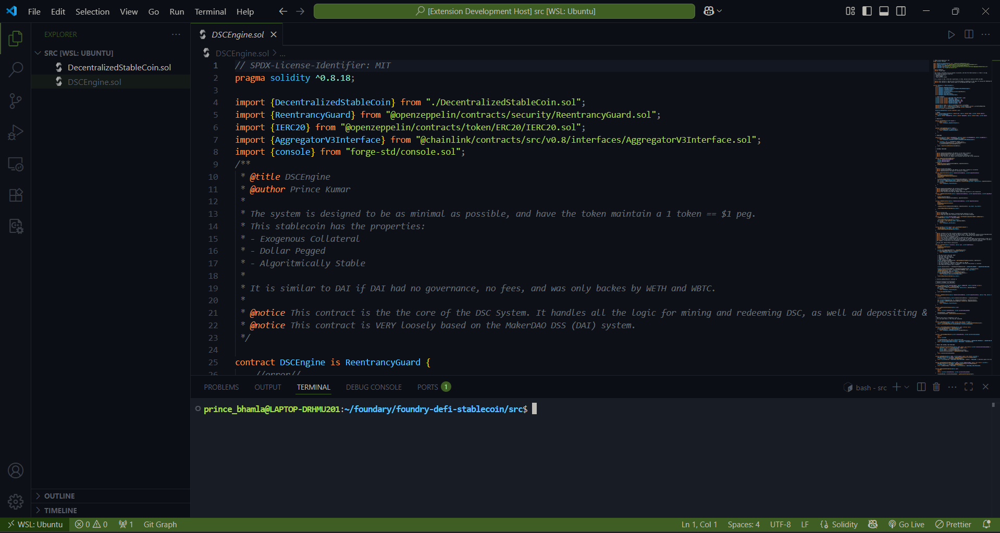

# 🌙 Paper Moon - VS Code Theme

**Paper Moon** is a soft, atmospheric Visual Studio Code theme designed to create a calm and focused coding environment. Inspired by muted natural tones and subtle contrasts, this theme blends legibility and elegance for long coding sessions—day or night.



---

## ✨ Features

- 🌾 Earthy green accents paired with soft neutrals
- 📦 Minimalist design, easy on the eyes
- 🧠 Thoughtful token colors for strong syntax clarity across languages
- ✅ Full support for semantic highlighting
- 🧩 Customized UI elements: dropdowns, tabs, terminal, sidebar, and more

---

## 🎨 Theme Highlights

| Element          | Color                | Description                        |
| ---------------- | -------------------- | ---------------------------------- |
| Background       | `#0d1017`            | Calm, dark canvas for your editor  |
| Foreground       | `#bfbdb6`            | Gentle text for reduced eye strain |
| Accent (Primary) | `#3e5e24`            | Soft green used for emphasis       |
| Error Color      | `#d95757`            | Noticeable yet non-intrusive       |
| Keyword Color    | `#ff8f40`            | Warm amber for keywords            |
| Strings & Tags   | `#aad94c`, `#59c2ff` | Clear and distinguishable          |

---

## 🛠 Installation

1. Launch **Visual Studio Code**
2. Go to **Extensions** (Ctrl+Shift+X)
3. Search for **"Paper Moon"**
4. Click **Install**
5. Open the Command Palette (Ctrl+Shift+P) and select:  
   `Preferences: Color Theme` → **Paper Moon**

---

## 🧪 Recommended Settings

To get the best visual experience, you might want to tweak the following settings:

```jsonc
"editor.fontFamily": "Fira Code, JetBrains Mono, Consolas, monospace",
"editor.fontLigatures": true,
"editor.cursorSmoothCaretAnimation": true,
"workbench.colorTheme": "Paper Moon"
```

- GitHub: [@princekumar](https://github.com/BhamlaPrince)
- LinkedIn: [Prince Kumar](https://www.linkedin.com/in/prince-kumar-342235237/)
- Twitter: [@BhamlaPrince](https://x.com/BhamlaPrince)
